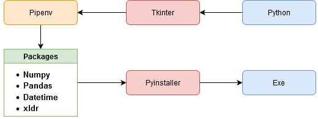

[](https://pypi.org/project/PyInstaller/)

# ForeignPermitSystem
Producing Foreign Permit Officialdocument by Python Tkinter GUI system
# Overview

# Download
```
git clone https://github.com/dapingtai/ForeignPermitSystem.git
```
# Flowchart


# Materials(Packages)
Pipenv-https://pypi.org/project/pipenv/
```
pip install pipenv
```
PyInstaller-https://pypi.org/project/PyInstaller/
```
pip install pyinstaller
```
Numpy & Pandas 
```
pip install numpy
pip install pandas
```
Xlrd-https://pypi.org/project/xlrd/
```
pip install xlrd
```
Datetime
```
pip install datetime
```
# Instructions


